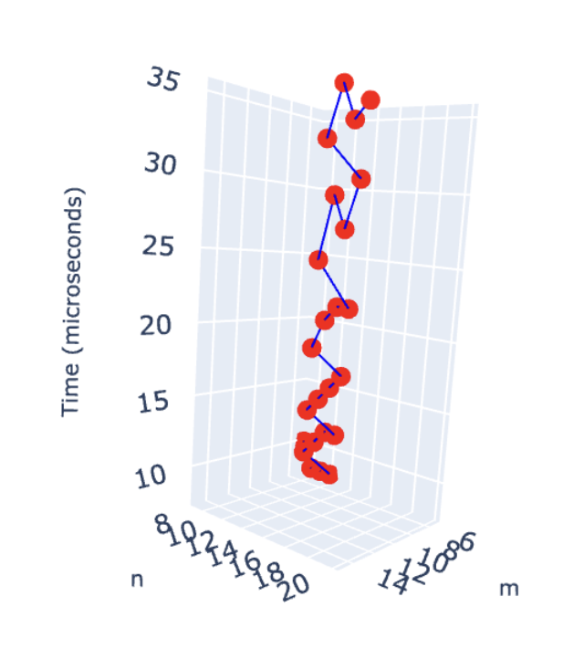
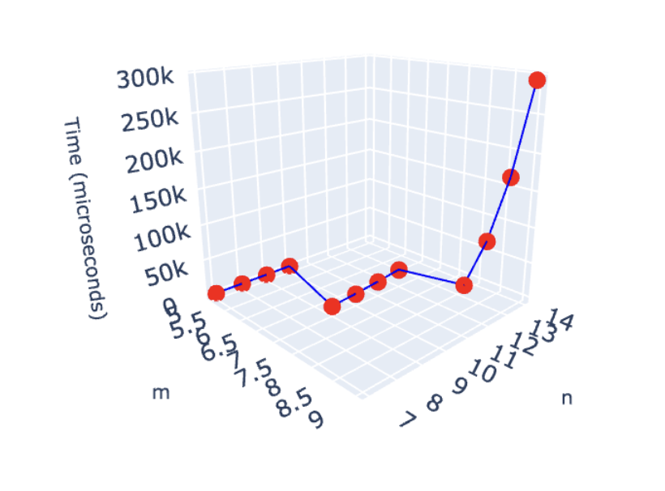

<h1 style="color:red;text-align:right">Aravind N 22BRS1099</h1>

# Lab-6: Longest Common Subsequence

## [Q1. LCS to print length](q1/soln.cpp)
[Question.](q1/README.md)

- Since there are m X n cells and each takes constant time to compute, the overall time complexity is O(m X n).

    

<!-- [View Interactive Plot]() Check -->
<iframe src="LPS-6/q1/plot.html" width="800" height="600"></iframe>

## [Q2. Print all LCSs](q2/soln.cpp)
[Question.](q2/README.md)
- Since there are m X n cells and each takes constant time to compute, the overall time complexity is O(m X n).

    

<!-- [View Interactive Plot]() Check -->
<iframe src="LPS-6/q1/plot.html" width="800" height="600"></iframe>
