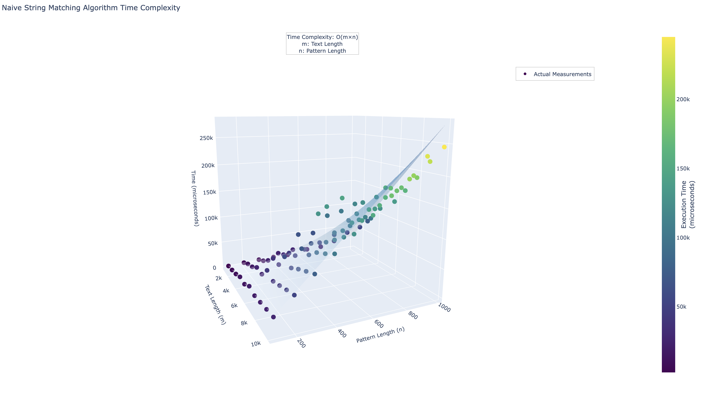

<h1 style="color:red;text-align:right">Aravind N 22BRS1099</h1>

# LPS-7: String Pattern Matching

## [Q1. Naive String Matching](q1/soln.cpp)
[Question.](q1/README.md)

- The time complexity of the Naive String Matching algorithm is O(m × n), where m is the length of the text and n is the length of the pattern.
- The algorithm compares each possible substring of the text with the pattern.

[View Interactive Plot](../docs/LPS7-q1.html)

The plot shows:
- A 3D visualization with actual measurements (colored dots) and theoretical complexity (semi-transparent surface).
- The x-axis represents text length (m), y-axis represents pattern length (n), and z-axis shows execution time in microseconds.
- The color gradient of points indicates execution time intensity, with darker colors representing shorter times.
- The theoretical surface (semi-transparent) demonstrates the expected O(m × n) complexity.
- The actual measurements align well with the theoretical complexity, showing quadratic growth as both text and pattern lengths increase.

## [Q2. String Categorization](q2/soln.cpp)
[Question.](q2/README.md)
- The algorithm performs three types of pattern matching for each substring:
  * Exact match check
  * Increasing pattern check
  * Decreasing pattern check
- The time complexity is O(m × n), where m is the text length and n is the pattern length, with a constant factor of 3 for the three checks.

[View Interactive Plot](../docs/LPS7-q2.html)

The plot demonstrates:
- A 3D scatter plot showing the relationship between text length, pattern length, and execution time.
- Vertical clusters of points representing measurements at different text lengths.
- The theoretical surface (purple/pink) represents the O(m × n) complexity with the constant factor for three checks.
- The execution time shows consistent growth with increasing input sizes, though the actual measurements are lower than the theoretical maximum due to optimizations and early termination in the matching process.
- The color gradient helps visualize the progression of execution times across different input combinations.

These visualizations effectively demonstrate how both algorithms scale with input size, with the Naive String Matching showing more predictable growth patterns compared to the more complex behavior of the String Categorization algorithm due to its multiple pattern checking mechanisms.