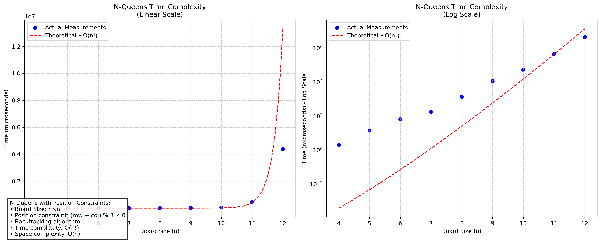
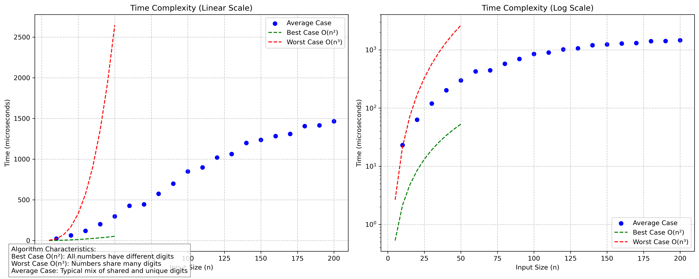

<h1 style="color:red;text-align:right">Aravind N 22BRS1099</h1>

# Lab 9
## [Q1. Move Diagonal Hate 3 Queen Game](q1/soln.cpp)
[Question.](q1/README.md)

    

## [Q2. Mutual-distinct-digit subset](q2/soln.cpp)
[Question.](q2/README.md)

    

